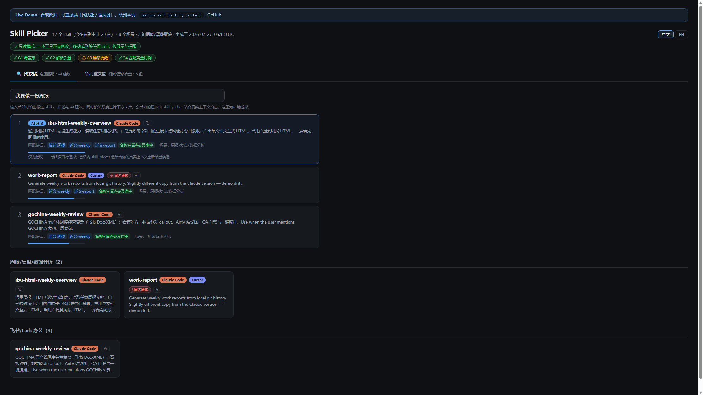
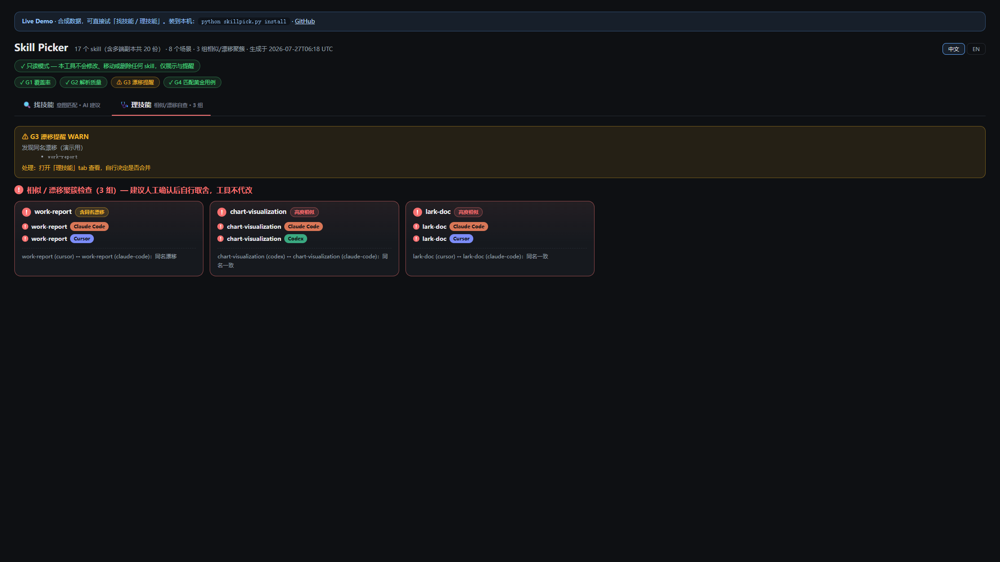

# Skill Picker

**本机 agent skills 装多了找不到？说一句意图，弹出 2–4 个候选让你点选；顺手标出重复与漂移。**

[](https://469910093-ui.github.io/Skill-picker/demo/)
[](LICENSE)
[](https://www.python.org/)
[](#)
[](#)

<p align="center">
  <a href="https://469910093-ui.github.io/Skill-picker/demo/">
    
  </a>
</p>

<p align="center"><b><a href="https://469910093-ui.github.io/Skill-picker/demo/">▶ 在线 Demo（无需安装）</a></b> · 试「做周报」「画图表」「做 PPT」</p>

---

English one-liner: **Forget skill names? Skill Picker turns “which skill for X?” into 2–4 clickable candidates — and flags duplicate/drifted skills. 100% local.**

## 30 秒安装

```bash
git clone https://github.com/469910093-ui/Skill-picker.git
cd Skill-picker
python skillpick.py install
```

一条命令完成：扫描全部 skill 目录 → 生成 `~/.skill-picker/catalog.md` + `dashboard.html` → meta-skill 装进 Cursor / Claude Code / Codex / OpenClaw → 工具自拷贝到 `~/.skill-picker/`。

给 coding agent 装：把本仓库丢给它，说 **install this**（见 [AGENTS.md](AGENTS.md)）。

## 你会得到什么

| 能力 | 说明 |
|---|---|
| **找技能** | 「用哪个 skill 做周报」→ 会话内 2–4 个候选 + AI 推荐，你自己点选 |
| **理技能** | 同名漂移、功能重叠自动圈出，红色感叹号提醒（只提示，不代删） |
| **本地看板** | 单文件 HTML，意图输入实时匹配，双击即可打开 |
| **四道门禁** | 覆盖率 / 解析质量 / 漂移 / 匹配黄金用例，每次扫描自检 |
| **100% 本地** | 无服务器、无账号、无外部 API、零第三方依赖（Python 标准库） |

<p align="center">
  
</p>

灵感来自 [tab-out](https://github.com/zarazhangrui/tab-out)：不管理数据，只读取已存在的事实；暴露冗余，决策留给用户。

## 装好后怎么用

1. **会话内**：说「帮我选个 skill 做周报」「有没有 skill 能剪视频」→ 弹出候选，点选后执行  
2. **看板**：打开 `~/.skill-picker/dashboard.html`（无需服务器）  
3. **CLI**：`python ~/.skill-picker/skillpick.py match "意图" --top 4 --json`

## 命令

| 命令 | 作用 |
|---|---|
| `python skillpick.py install` | 扫描 + 装 meta-skill + 自拷贝 |
| `python skillpick.py scan` / `check` | 刷新索引；退出码 0=可信 / 2=门禁 FAIL |
| `python skillpick.py match "意图"` | 共享引擎检索候选 |
| `python skillpick.py serve` | 本地看板服务（可选） |
| `python -m unittest discover -s tests` | 测试（含黄金匹配回归） |

## 架构（一图）

```
rules.json ──── 近义词 / 权重 / 分类 / 黄金用例（唯一可调参）
    │
    ├── matching.py ── 共享打分引擎
    │       ├── mcp_server.py   ← ① MCP 插件
    │       ├── skillpick.py    ← ② CLI
    │       └── tests/          ← 回归
    └── dashboard.py ── JS 同构镜像（页面搜索 = 会话路由）
```

三级降级：MCP → CLI + HTML → 系统浏览器打开 `dashboard.html`。

## 门禁

| 门禁 | 含义 | FAIL 时 |
|---|---|---|
| **G1 覆盖率** | 有 skill 目录没扫到 | 加进 `~/.skill-picker/config.json` 的 `extra_roots` 后重跑 `check` |
| **G2 解析质量** | 缺描述占比过高 | WARN，列出问题 skill |
| **G3 漂移** | 同名多端内容不一致 | 打开「理技能」自行取舍（工具不代删） |
| **G4 黄金用例** | 匹配引擎回归 | 请开 issue |

## 只读铁律

**永不修改、移动、删除任何已有 skill 文件**，只写 `~/.skill-picker/`。

## 相关：从 GitHub 发现新 skill

skill-picker **只索引本机已装 skills**（100% 本地，不联网）。  
若要从 GitHub / HelloGitHub 发现远程 skill，请用拆出来的兄弟产品 **skill-feed**（无限下滑 Feed + 门禁 + 打开 GitHub；**不代装**。你自行安装后再跑本工具的 `scan`）。

## 文档

- [在线 Demo](https://469910093-ui.github.io/Skill-picker/demo/)
- [给 Agent 的安装指南](AGENTS.md)
- [推广 / 发布清单](docs/LAUNCH.md)
- [贡献指南](CONTRIBUTING.md)
- [更新日志](CHANGELOG.md)

## 更新

```bash
git pull
python skillpick.py install          # 或
python ~/.skill-picker/skillpick.py scan
```

---

MIT · 若有用请 ⭐ —— 比互赞群靠谱。
